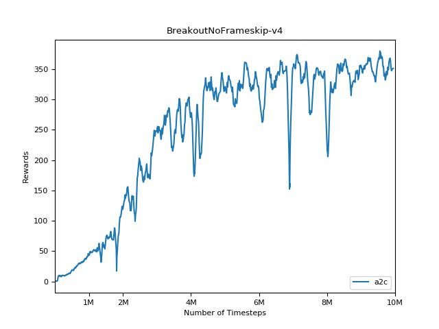
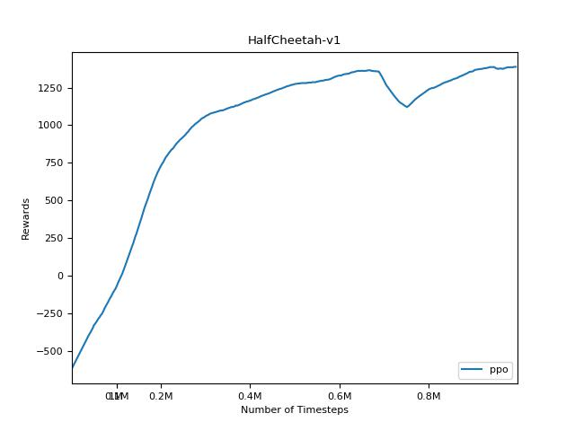
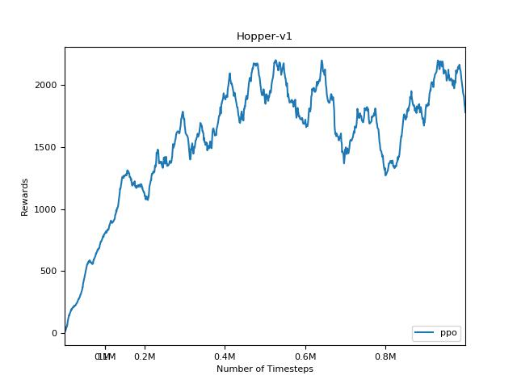
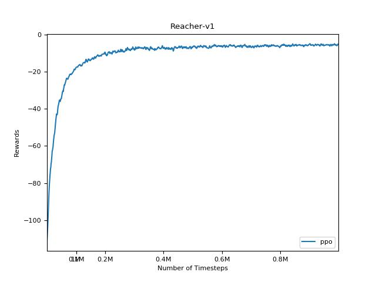
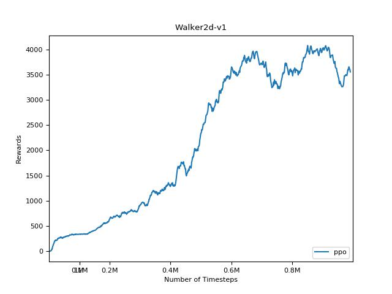
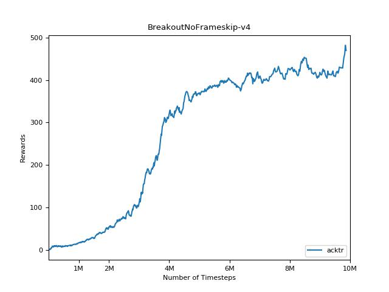
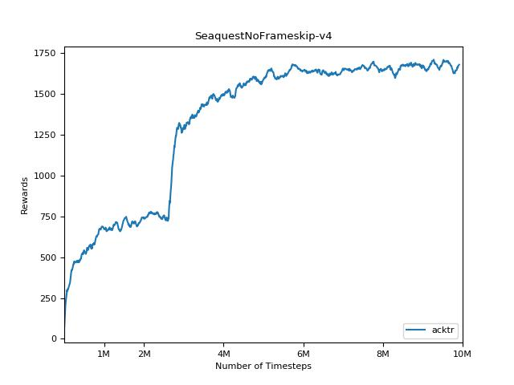
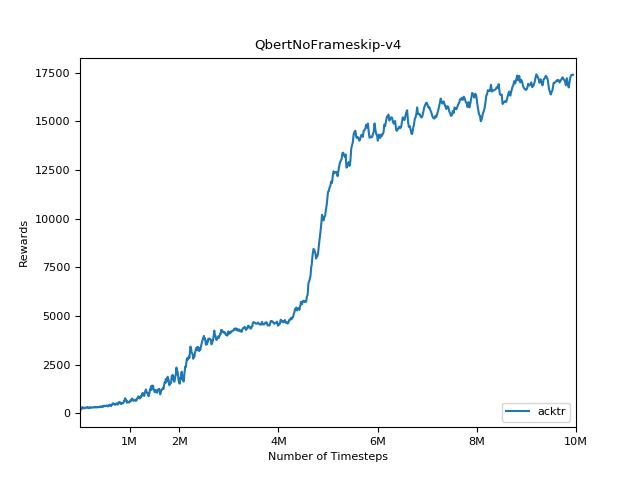
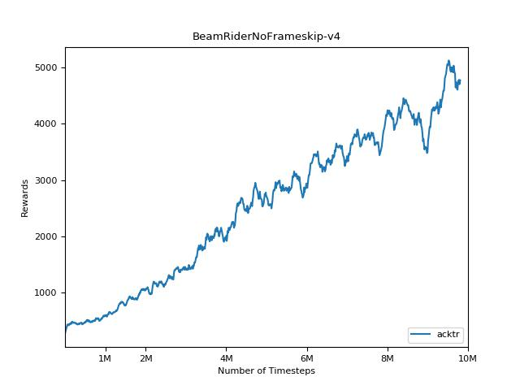

# Pytorch Reinforcement Visualization

## Supported (and tested) environments (via [OpenAI Gym](https://gym.openai.com))
* [Atari Learning Environment](https://github.com/mgbellemare/Arcade-Learning-Environment)
* [MuJoCo](http://mujoco.org)
* [PyBullet](http://pybullet.org) (including Racecar, Minitaur and Kuka)

I highly recommend PyBullet as a free open source alternative to MuJoCo for continuous control tasks.

All environments are operated using exactly the same Gym interface. See their documentations for a comprehensive list.
 
## Requirements

* Python 3 (it might work with Python 2, but I didn't test it)
* [PyTorch](http://pytorch.org/)
* [Visdom](https://github.com/facebookresearch/visdom)
* [OpenAI baselines](https://github.com/openai/baselines)

In order to install requirements, follow:

```bash
# PyTorch
conda install pytorch torchvision -c soumith

# Baselines for Atari preprocessing
git clone https://github.com/openai/baselines.git
cd baselines
pip install -e .

# Other requirements
pip install -r requirements.txt
```

## Training

Start a `Visdom` server with `python -m visdom.server`, it will serve `http://localhost:8097/` by default.

### Atari
#### A2C

```bash
python main.py --env-name "PongNoFrameskip-v4"
```

#### PPO

```bash
python main.py --env-name "PongNoFrameskip-v4" --algo ppo --use-gae --num-processes 8 --num-steps 256 --vis-interval 1 --log-interval 1
```

#### ACKTR

```bash
python main.py --env-name "PongNoFrameskip-v4" --algo acktr --num-processes 32 --num-steps 20
```

### MuJoCo
#### A2C

```bash
python main.py --env-name "Reacher-v1" --num-stack 1 --num-frames 1000000
```

#### PPO

```bash
python main.py --env-name "Reacher-v1" --algo ppo --use-gae --vis-interval 1  --log-interval 1 --num-stack 1 --num-steps 2048 --num-processes 1 --lr 3e-4 --entropy-coef 0 --ppo-epoch 10 --batch-size 64 --gamma 0.99 --tau 0.95 --num-frames 1000000
```

#### ACKTR

ACKTR requires some modifications to be made specifically for MuJoCo. But at the moment, I want to keep this code as unified as possible. Thus, I'm going for better ways to integrate it into the codebase.

## Enjoy

Load a pretrained model from [my Google Drive](https://drive.google.com/open?id=0Bw49qC_cgohKS3k2OWpyMWdzYkk).

Disclaimer: I might have used different hyper-parameters to train these models.

### Atari

```bash
python enjoy.py --load-dir trained_models/a2c --env-name "PongNoFrameskip-v4" --num-stack 4
```

### MuJoCo

```bash
python enjoy.py --load-dir trained_models/ppo --env-name "Reacher-v1" --num-stack 1
```

## Results

### A2C




### PPO











### ACKTR








